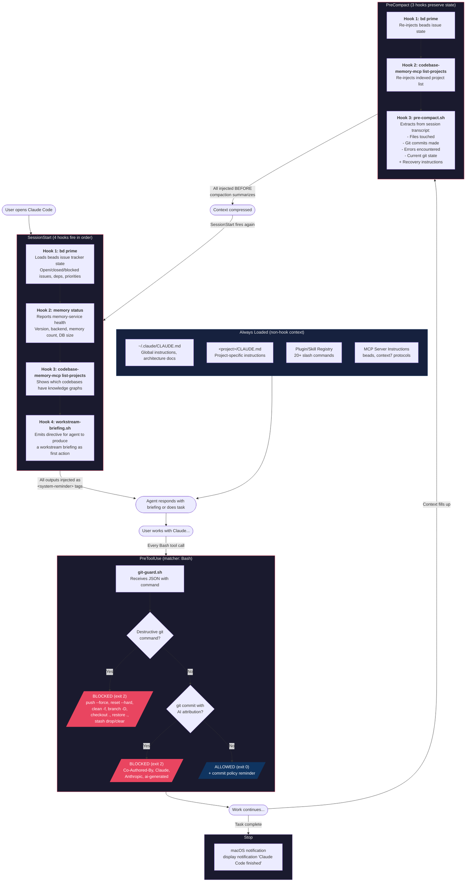
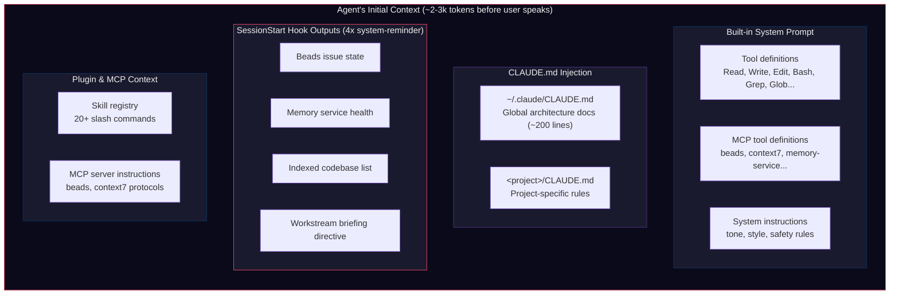
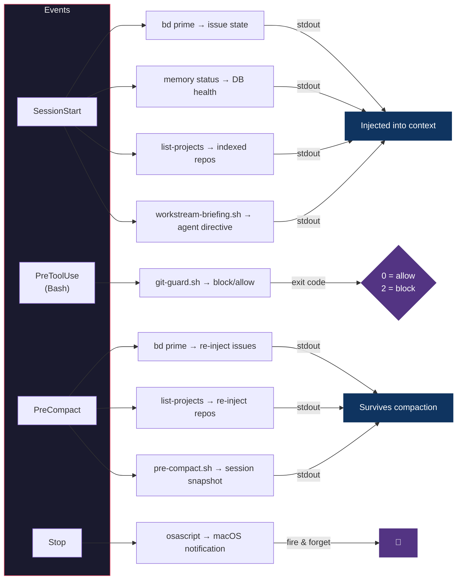

# Claude Code Hooks & Context Injection Lifecycle

## Session Lifecycle

```mermaid
flowchart TD
    Start([User opens Claude Code]) --> SS

    subgraph SS["SessionStart (4 hooks fire in order)"]
        direction TB
        H1["<b>Hook 1: bd prime</b><br/>Loads beads issue tracker state<br/>Open/closed/blocked issues, deps, priorities"]
        H2["<b>Hook 2: memory status</b><br/>Reports memory-service health<br/>Version, backend, memory count, DB size"]
        H3["<b>Hook 3: codebase-memory-mcp list-projects</b><br/>Shows which codebases have knowledge graphs"]
        H4["<b>Hook 4: workstream-briefing.sh</b><br/>Emits directive for agent to produce<br/>a workstream briefing as first action"]
        H1 --> H2 --> H3 --> H4
    end

    subgraph AL["Always Loaded (non-hook context)"]
        direction TB
        C1["~/.claude/CLAUDE.md<br/>Global instructions, architecture docs"]
        C2["&lt;project&gt;/CLAUDE.md<br/>Project-specific instructions"]
        C3["Plugin/Skill Registry<br/>20+ slash commands"]
        C4["MCP Server Instructions<br/>beads, context7 protocols"]
    end

    SS -- "All outputs injected as<br/>&lt;system-reminder&gt; tags" --> Agent
    AL --> Agent([Agent responds with briefing or does task])

    Agent --> Work([User works with Claude...])
    Work -- "Every Bash tool call" --> PTU

    subgraph PTU["PreToolUse (matcher: Bash)"]
        direction TB
        GG["<b>git-guard.sh</b><br/>Receives JSON with command"]
        GG --> Check1{"Destructive git<br/>command?"}
        Check1 -- "Yes" --> Block1[/"BLOCKED (exit 2)<br/>push --force, reset --hard,<br/>clean -f, branch -D,<br/>checkout ., restore .,<br/>stash drop/clear"/]
        Check1 -- "No" --> Check2{"git commit with<br/>AI attribution?"}
        Check2 -- "Yes" --> Block2[/"BLOCKED (exit 2)<br/>Co-Authored-By, Claude,<br/>Anthropic, ai-generated"/]
        Check2 -- "No" --> Allow[/"ALLOWED (exit 0)<br/>+ commit policy reminder"/]
    end

    PTU --> Work2([Work continues...])
    Work2 -- "Context fills up" --> PC

    subgraph PC["PreCompact (3 hooks preserve state)"]
        direction TB
        P1["<b>Hook 1: bd prime</b><br/>Re-injects beads issue state"]
        P2["<b>Hook 2: codebase-memory-mcp list-projects</b><br/>Re-injects indexed project list"]
        P3["<b>Hook 3: pre-compact.sh</b><br/>Extracts from session transcript:<br/>- Files touched<br/>- Git commits made<br/>- Errors encountered<br/>- Current git state<br/>+ Recovery instructions"]
        P1 --> P2 --> P3
    end

    PC -- "All injected BEFORE<br/>compaction summarizes" --> Compact([Context compressed])
    Compact -- "SessionStart fires again" --> SS

    Work2 -- "Task complete" --> Stop

    subgraph Stop["Stop"]
        Notify["macOS notification<br/>display notification 'Claude Code finished'"]
    end

    style SS fill:#1a1a2e,stroke:#e94560,color:#eee
    style AL fill:#16213e,stroke:#0f3460,color:#eee
    style PTU fill:#1a1a2e,stroke:#e94560,color:#eee
    style PC fill:#1a1a2e,stroke:#e94560,color:#eee
    style Stop fill:#1a1a2e,stroke:#533483,color:#eee
    style Block1 fill:#e94560,stroke:#e94560,color:#fff
    style Block2 fill:#e94560,stroke:#e94560,color:#fff
    style Allow fill:#0f3460,stroke:#0f3460,color:#fff
```

## Status Line (continuous)

```mermaid
flowchart LR
    subgraph Input["JSON via stdin"]
        direction TB
        I1["model.display_name"]
        I2["context_window.used_percentage"]
        I3["context_window.total_input_tokens"]
        I4["context_window.total_output_tokens"]
        I5["workspace.current_dir"]
    end

    Input --> Script["status-line.sh"]

    Script --> Output["<span style='color:#5555ff'>Claude Opus 4.6</span> <span style='color:#ffff55'>ctx:23% (77% left)</span> <span style='color:#ff55ff'>⬇12.5k ⬆3.2k</span> <span style='color:#55ffff'>⚓~/myapp</span> <span style='color:#ff55aa'>main</span>"]

    style Input fill:#16213e,stroke:#0f3460,color:#eee
    style Script fill:#1a1a2e,stroke:#533483,color:#eee
    style Output fill:#0a0a1a,stroke:#e94560,color:#eee
```

## What Claude Sees on Startup

```mermaid
flowchart TB
    subgraph Context["Agent's Initial Context (~2-3k tokens before user speaks)"]
        direction TB

        subgraph Builtin["Built-in System Prompt"]
            T1["Tool definitions<br/>Read, Write, Edit, Bash, Grep, Glob..."]
            T2["MCP tool definitions<br/>beads, context7, memory-service..."]
            T3["System instructions<br/>tone, style, safety rules"]
        end

        subgraph ClaudeMD["CLAUDE.md Injection"]
            M1["~/.claude/CLAUDE.md<br/>Global architecture docs (~200 lines)"]
            M2["&lt;project&gt;/CLAUDE.md<br/>Project-specific rules"]
        end

        subgraph Hooks["SessionStart Hook Outputs (4x system-reminder)"]
            R1["Beads issue state"]
            R2["Memory service health"]
            R3["Indexed codebase list"]
            R4["Workstream briefing directive"]
        end

        subgraph Plugins["Plugin & MCP Context"]
            P1["Skill registry<br/>20+ slash commands"]
            P2["MCP server instructions<br/>beads, context7 protocols"]
        end
    end

    style Context fill:#0a0a1a,stroke:#e94560,color:#eee
    style Builtin fill:#1a1a2e,stroke:#0f3460,color:#eee
    style ClaudeMD fill:#1a1a2e,stroke:#533483,color:#eee
    style Hooks fill:#1a1a2e,stroke:#e94560,color:#eee
    style Plugins fill:#1a1a2e,stroke:#0f3460,color:#eee
```

## Hook Reference

```mermaid
flowchart LR
    subgraph Events
        direction TB
        E1["SessionStart"]
        E2["PreToolUse<br/>(Bash)"]
        E3["PreCompact"]
        E4["Stop"]
    end

    E1 --> S1["bd prime → issue state"]
    E1 --> S2["memory status → DB health"]
    E1 --> S3["list-projects → indexed repos"]
    E1 --> S4["workstream-briefing.sh → agent directive"]

    E2 --> S5["git-guard.sh → block/allow"]

    E3 --> S6["bd prime → re-inject issues"]
    E3 --> S7["list-projects → re-inject repos"]
    E3 --> S8["pre-compact.sh → session snapshot"]

    E4 --> S9["osascript → macOS notification"]

    S1 & S2 & S3 & S4 -- "stdout" --> CTX["Injected into context"]
    S5 -- "exit code" --> GATE{"0 = allow<br/>2 = block"}
    S6 & S7 & S8 -- "stdout" --> CTX2["Survives compaction"]
    S9 -- "fire & forget" --> BELL["🔔"]

    style Events fill:#1a1a2e,stroke:#e94560,color:#eee
    style CTX fill:#0f3460,stroke:#0f3460,color:#fff
    style CTX2 fill:#0f3460,stroke:#0f3460,color:#fff
    style GATE fill:#533483,stroke:#533483,color:#fff
    style BELL fill:#533483,stroke:#533483,color:#fff
```
